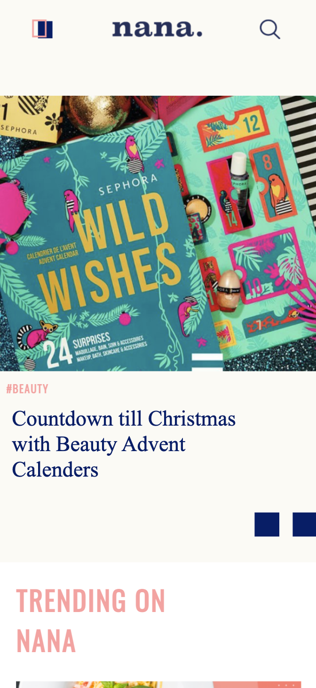
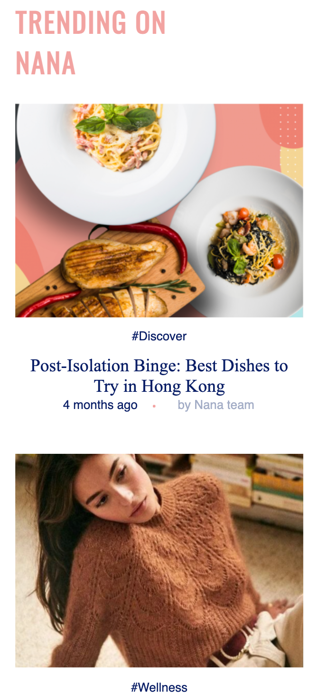
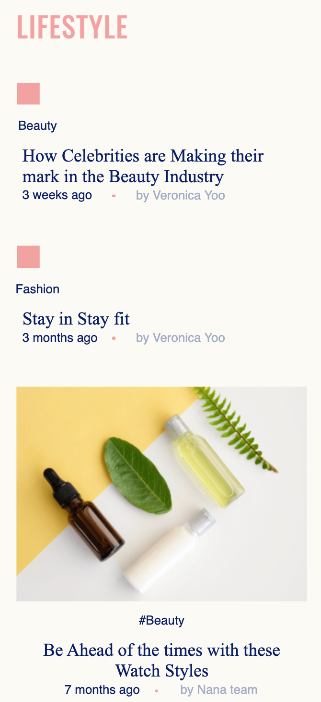
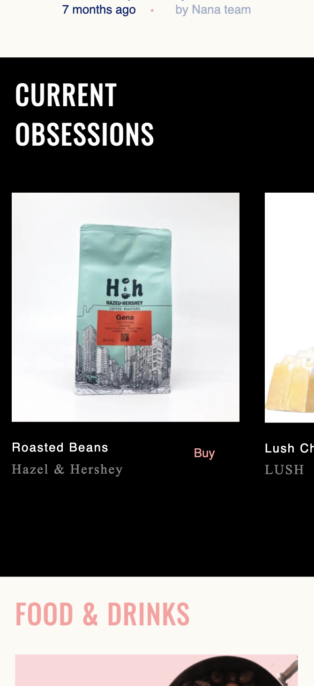
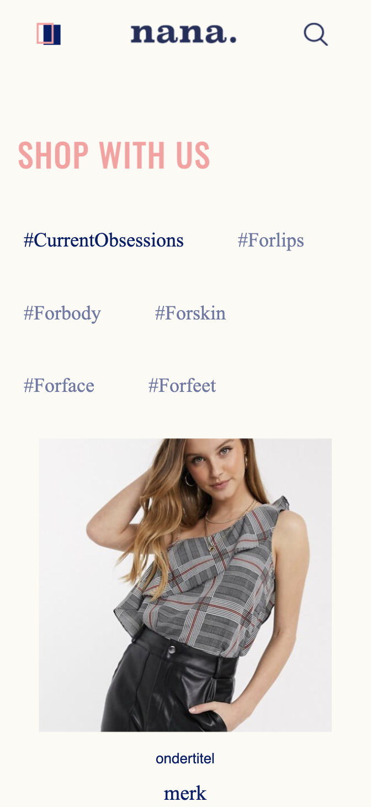
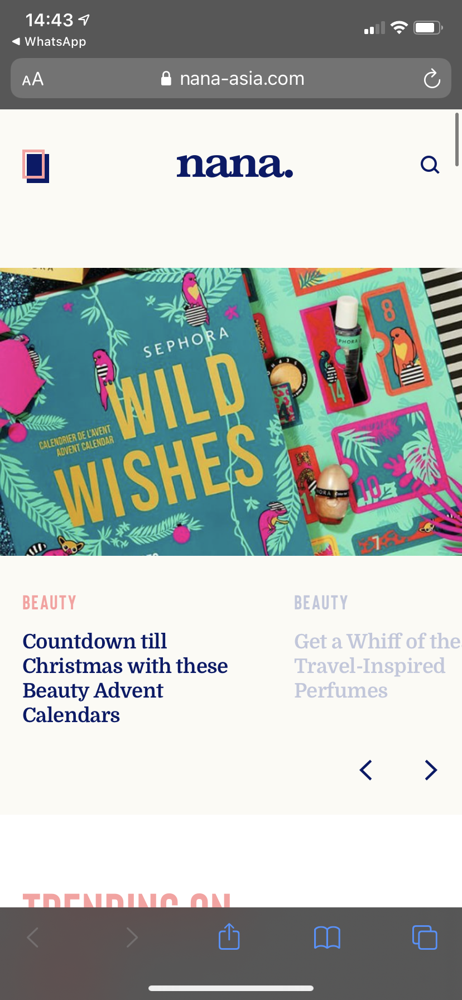
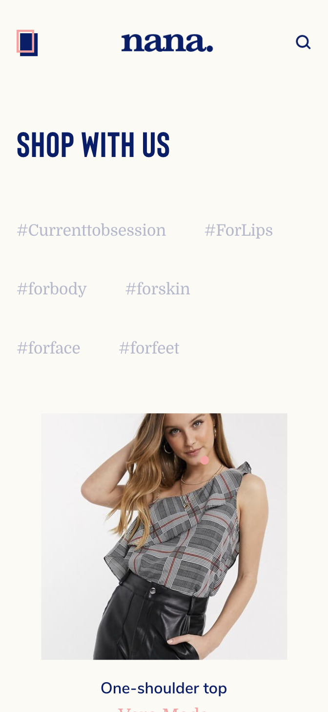

# Procesverslag
**Auteur:** Noa Bos

Markdown cheat cheet: [Hulp bij het schrijven van Markdown](https://github.com/adam-p/markdown-here/wiki/Markdown-Cheatsheet). Nb. de standaardstructuur en de spartaanse opmaak zijn helemaal prima. Het gaat om de inhoud van je procesverslag. Besteedt de tijd voor pracht en praal aan je website.

## Bronnenlijst
1. bron : https://www.javascripttutorial.net/javascript-dom/javascript-queryselector
2. -bron 2-
3. -...-

## Eindgesprek (week 7/8)

-dit ging goed & dit was lastig-

**Screenshot(s):**

-screenshot(s) van je eindresultaat-

## Voortgang 3 (week 6)

-same as voortgang 1-

## Voortgang 2 (week 5)

-same as voortgang 1-

## Voortgang 1 (week 3)

### Stand van zaken

Over het algemeen ging het best goed. Wel vond ik deze dingen erg lastig: Navigatie, searchbar en de banner slider. Ik ben ook nog niet helemaal klaar met deze items. Zo moet ik bij de searchbalk, de searchbalk zelf nog toevoegen. Bij navigatie moeten de social media icons nog onderaan. En bij de banner slider moet de tekst nog grijs worden wanner hij niet geselecteerd is.

**Screenshot(s):**

### Agenda voor meeting

Daan.
Hoe trigger je een animatie als het element daarvoor in jou scherm verschijnt?

Dewi.
mag je dingen aanpassen als je dat zelf beter vindt? bv header fixed maken

Noa.
Voldoende variatie in content?  | Moet ik nog: Search bar, tweede pagina , Navigatie icons

Inez.
Hoe maak ik de header responsive als hij er compleet anders uitziet op desktop dan op mobiel?

Niels.
Hoe zorg je dat een element beweegt doordat jij scrolled?

### Verslag van meeting

-na afloop snel uitkomsten vastleggen-

## Breakdownschets (week 1)

## Intake (week 1)

**Je startniveau:** Blauwe piste 

**Je focus:** Surface

**Je opdracht:** https://nana-asia.com

**Screenshot(s) van de eerste pagina (small screen):**

**Screenshot(s) van de tweede pagina (small screen):**

