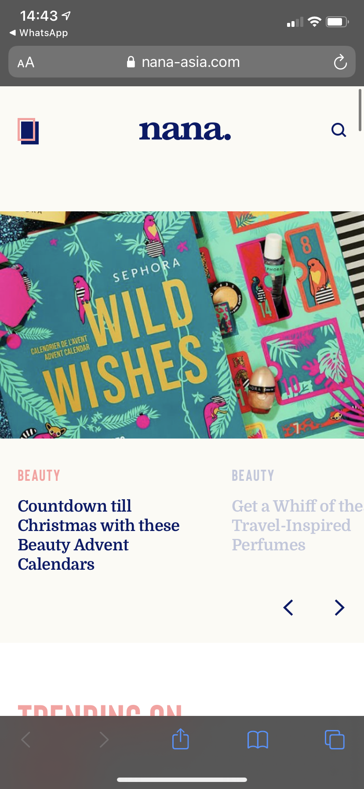

# Procesverslag
**Auteur:** Noa Bos | 500791864 | 201

## Bronnenlijst
1. Uitlegbron van queryselector : https://www.javascripttutorial.net/javascript-dom/javascript-queryselector
2. Daan Zwarthoed heeft mij geholpen met de hover JS! Die ik uiteindelijk niet heb gebruikt... Sorry Daan!
3. Uitlegbron van de animaties: https://developer.mozilla.org/en-US/docs/Web/CSS/animation
4. Inspiratiebron voor de animaties: https://codepen.io/shooft/pen/xxVmpEP
5. Inspiratiebron van de foto's met filter: https://codepen.io/dudleystorey/pen/KGABc
6. Inspiratiebron voor de slider: https://codepen.io/rokobuljan/pen/XXzqKQ
7. JS inspiratiebron voor de slider: https://forum.freecodecamp.org/t/can-somebody-explain-to-me-this-javascript-code-please/243460
8. Uitleg van Classlist: https://developer.mozilla.org/en-US/docs/Web/API/Element/classList
9. Voor de searchbar: https://developer.mozilla.org/en-US/docs/Web/CSS/clip-path
9. En natuurlijk: nana-asia.com !

## Eindgesprek (week 7/8)

Dit ging goed:
Naarmate ik er meer tijd in ging besteden, ging het ook steeds beter; logisch... Maar coderen blijft niet helemaal 'mijn ding'. Wat erg goed ging was dat ik vrij snel de html code neer had gezet. Hierdoor had ik bij de eerste voortgang meteen al een kleine voorsprong, deze verloor ik al de week daarna, maar het gaat om het idee! Ook verliepen de Keyframes mij best goed, eerst zat ik hier best overin, maar dat ging goed! Uiteindelijk heb ik nog 7 animaties ook! Ook ben ik trots op mijn carousel, deze had ik vrij snel in elkaar. Daarna heb ik Suzanne geholpen met die van haar.

De animaties die ik heb gemaakt:
1. De Slider
2. De menu uitklapper
3. De dansende letters
4. De blokjes veranderen van kleur
5. Het bungelende pijltje
6. De lijntjes onder de footer linkjes
7. Het send knopje

Dit was HEEL lastig:
Javascript blijft bij mij een heikel punt. Voor mijn gevoel moest ik alles weer opnieuw leren, met betrekking tot Javascript dan. Desalniettemin ben ik toch ver gekomen! Ook vind ik het lastig om hulp te vragen. Ik wil altijd eerst altijd liever eerst uitzoeken, en dat is goed, maar niet als je al 6 uur vast zit... Zo bleef ik telkens ergens te lang stilstaan, hierdoor kwam ik soms in tijdnood  Ook is de popup uit mijn search-button niet gelukt, ik had die graag wel af willen zien. Daarnaast is de belijning in mijn uitklap menu een beetje gekkig. Ook is de slider op mijn home pagina, niet zoals ik 'm had willen zien. Op de echte site kan je deze met pijltjes navigeren. Ook komt de tekst van de volgende afbeelding, in de slider, al naar voren. Dit was ook niet gelukt, het is een keyframe slider geworden. Ook wilde ik eerst responsive kiezen, gelukkig heb ik dat niet gedaan, want ik kwam er echt niet uit! Media queries snapte ik wel, maar alles ging mis...

**Screenshot(s):**

## Toegankelijkehid
Voor de toegankelijkheid ben ik de checklist van https://www.a11yproject.com/checklist/ nagegaan. Hier scoorde mijn site heel goed. Daarna heb ik gekeken naar het filmpje. En toen ben ik verdergegaan met de test in 'reallife', dit door door mijn site heen te navigeren met een stem. De alts achter de foto's werken goed. De structuur van mijn site is logisch en de linkjes werken prima.

## Voortgang 3 (week 6)

### Stand van zaken
Deze week heb ik de puntjes op de i kunnen zetten, mijn navigatie balk is af en ik heb pijltjes kunnen maken van de blokjes. Helaas is het zetten van iets in de search balk nog niet gelukt... Iris help! De volgende stap is het toevoegen van de animaties!

### Agenda voor meeting

Daan.
Kan je mij feedback geven op mijn readme? En kan je een voorbeeld geven van een verslag over de screenreader?

Dewi.
Ik wil weten hoezo er iets fout gaat met de marge in mijn carrousel.

Noa.
Hoe zet ik iets in mijn dropdown van mn searchbalk? En wanneer je surface laag doet, moet je scherm dan ook horizontaal responsive zijn? En hoeveel animaties moet je, bij de surface laag?

Inez.
Hoe maak je een goed hamburger menu? Hoe maak je je website responsive zonder alles te breken?

### Verslag van meeting

Ik heb aan Janno kunnen vragen of het horizontaal neerzetten van het scherm echt moest, want eigenlijk moest je dan responsive én surface doen. Gelukkig heeft Janno zich bedacht en was dit niet meer nodig.

## Voortgang 2 (week 5)

### Stand van zaken
Vergeleken met vorige week heb ik nog niet heel veel kunnen doen. Ik heb besloten om aan de Responsive opdracht te werken. Bij de telefoon website moet ik alleen nog de puntje op de i zetten, op de desktop website is er nog veel werk te doen. Gelukkig is mijn navigatie responsive, nu de rest nog!

### Agenda voor meeting

Daan.
Hoeveel comments moet je ongeveer in je code hebben?

Dewi.
ik wil weten hoeveel animaties ik ongeveer moet maken

Noa.
Hoe maak ik die banner anders met hover de tekst in desktop en in mobiel pijtlje gebruiken?

Inez.
Hoe zorg je ervoor dat je website werkt op meerdere telefoons en landscape mode?

Niels.
Hoe zorg je dat een element beweegt doordat jij scrolled?

### Verslag van meeting

Het ging redelijk goed, Janno raadde me aan om voor de surface laag te kiezen, ipv. de responsive laag.

## Voortgang 1 (week 3)

### Stand van zaken

Over het algemeen ging het best goed. Wel vond ik deze dingen erg lastig: Navigatie, searchbar en de banner slider. Ik ben ook nog niet helemaal klaar met deze items. Zo moet ik bij de searchbalk, de searchbalk zelf nog toevoegen. Bij navigatie moeten de social media icons nog onderaan. En bij de banner slider moet de tekst nog grijs worden wanner hij niet geselecteerd is.

**Screenshot(s):**

### Agenda voor meeting

Daan.
Hoe trigger je een animatie als het element daarvoor in jou scherm verschijnt?

Dewi.
mag je dingen aanpassen als je dat zelf beter vindt? bv header fixed maken

Noa.
Voldoende variatie in content?  | Moet ik nog: Search bar, tweede pagina , Navigatie icons

Inez.
Hoe maak ik de header responsive als hij er compleet anders uitziet op desktop dan op mobiel?

Niels.
Hoe zorg je dat een element beweegt doordat jij scrolled?

### Verslag van meeting

Het ging heel goed! Iris vertelde me dat ik voorliep, blij mee!

## Breakdownschets (week 1)

## Intake (week 1)

**Je startniveau:** Blauwe piste

**Je focus:** Surface plane

**Je opdracht:** https://nana-asia.com

**Screenshot(s) van de eerste pagina (small screen):**

**Screenshot(s) van de tweede pagina (small screen):**

